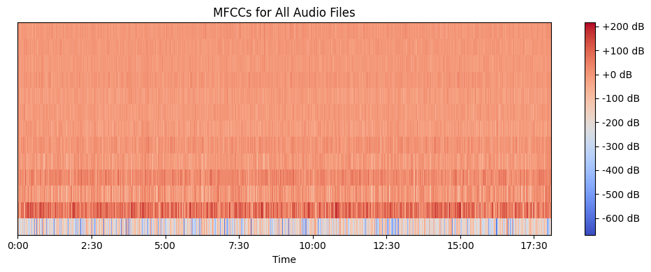
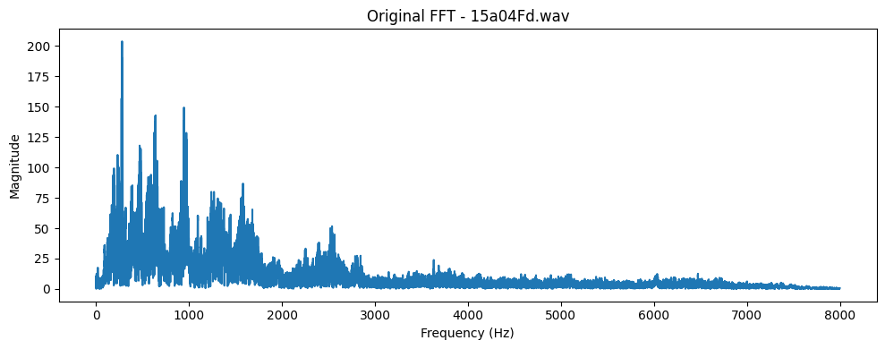
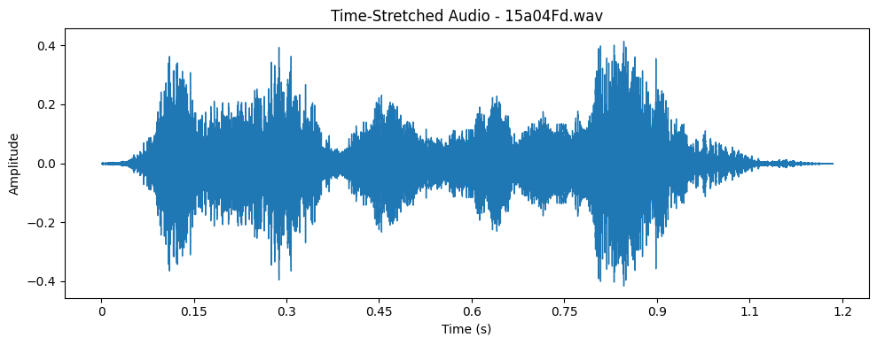
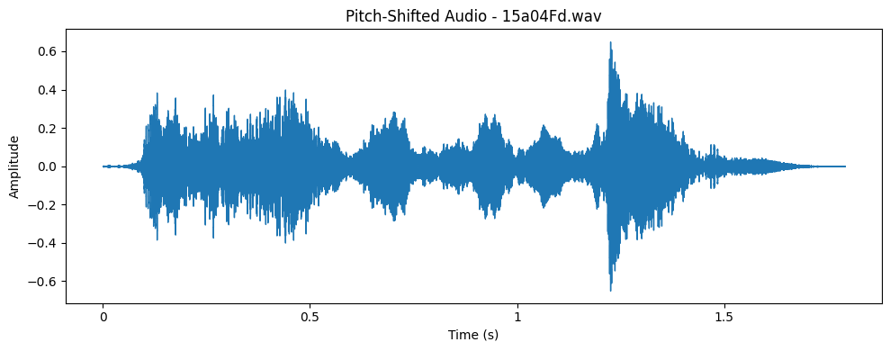
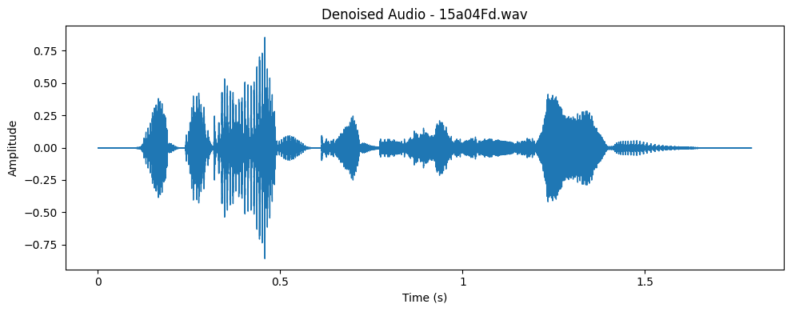
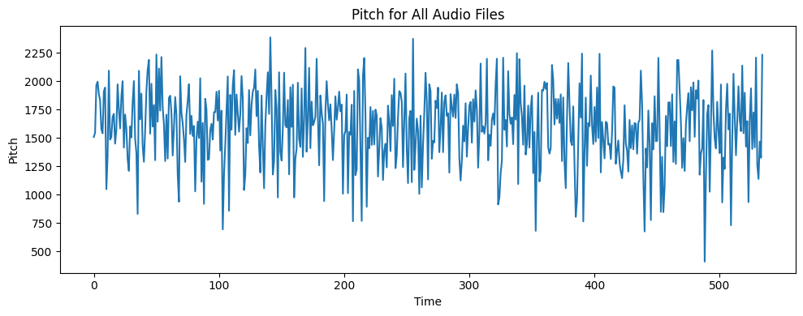
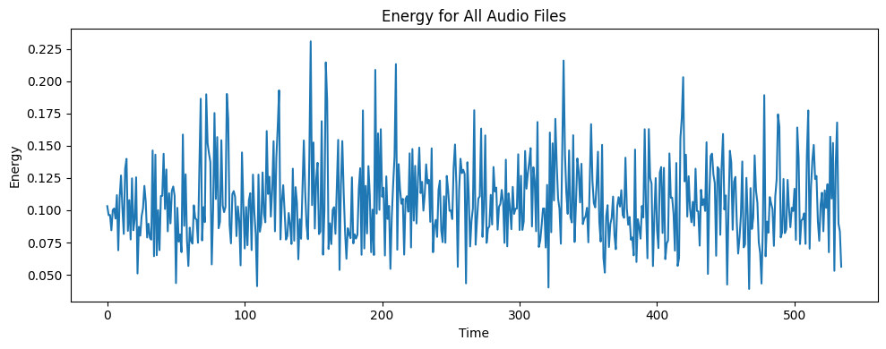

#  Emotion Detection from Speech (Multimedia Project)

This project explores how signal processing and machine learning can be combined to detect human emotions from speech using the EMO-DB dataset.

---

##  Team Members

- Mariam Raafat  
- Engy Refaai  
- Alyaa Tamer  
- Soher Mohamed

---

##  Project Objectives

- Preprocess and clean raw audio signals
- Extract features (MFCCs, Pitch, Energy)
- Visualize signal transformations (Waveform, FFT)
- Train a neural network model (MLPClassifier)
- Evaluate model performance

---

##  Dataset

- **Name:** EMO-DB (Berlin Database of Emotional Speech)
- **Language:** German
- **Emotions:**
  - Anger
  - Boredom
  - Anxiety
  - Happiness
  - Sadness
  - Disgust
  - Neutral

---

##  Technologies Used

| Tool / Library | Description |
|----------------|-------------|
| `librosa` | Audio feature extraction |
| `noisereduce` | Denoising audio signals |
| `scikit-learn` | ML models, scaling, encoding |
| `matplotlib` | Visualizations |
| `soundfile` | Saving audio files |
| `numpy` | Array operations |

---


###  Sample Visualizations

####  MFCC


####  Original Audio



####  Time-Stretched Audio


####  Pitch-Shifted Audio


####  Equalized Audio


####  Denoised Audio


####  Pitch & Energy Features



---


##  How to Run

### 1. Install dependencies

```bash
pip install -r requirements.txt
